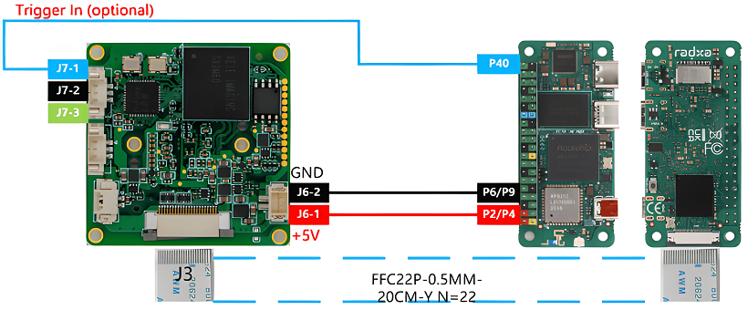

# How to use GX series cameras on Radxa's RK35XX board
This is a mirror of [our wiki article](https://wiki.veye.cc/index.php/GX_Camera_on_Radxa_Boards).

[toc]

## Overview
The GX series cameras are cameras designed for AI applications in the industrial field. They use the MIPI CSI-2 interface and are particularly suitable for use with embedded computing platforms. They have rich data formats and triggering features, extremely low latency, high bandwidth, and reliable stability.

This article takes Radxa's ZERO 3W/3E board as an example to introduce how to connect GX series cameras to the RK3566/3K3568 system.

We provide drivers for the Linux operating system (using Radxa OS Debainas an example).

### Camera Module List

| Series  | Model  | Status  |
| ------------ | ------------ | ------------ |
| GX series	 | GX-MIPI-IMX662	| Done  |
## Hardware Setup

### Connection of other GX series camera and Radxa ZERO 3W/3E
The two are connected using 0.5 mm pitch*22pin FFC cable with opposite-side contacts. The cable must be inserted with the silver contacts facing outside.



## Introduction to github repositories
https://github.com/veyeimaging/rk35xx_radxa/

includes:
- driver source code
- i2c toolkits
- application demo

In addition, a compiled linux kernel installation package is provided in the [releases](https://github.com/veyeimaging/rk35xx_radxa/releases/).
## Upgrade the Ubuntu system
### Overview
This section describes how to update the RK35xx system to support our camera modules.

We provide a deb installation package that can be installed directly.
### Burn Radxa standard system
Refer to the Radxa documentation to burn in a standard system.

The installation package we are currently releasing is based on [this image version](https://github.com/radxa-build/radxa-zero3/releases/download/b6/radxa-zero3_debian_bullseye_xfce_b6.img.xz).

### Using prebuilt Image and dtb file
Using the compiled debain installation package
On the RK35xx board,
Download the latest rk356x_radxa_zero3w_gxmcam.tar.gz from
[releases](https://github.com/veyeimaging/rk35xx_radxa/releases/)
```
tar -xavf rk356x_radxa_zero3w_gxmcam.tar.gz

cd rk356x_radxa_zero3w_gxmcam

sudo dpkg -i linux-headers-5.10.160-39-rk356x_5.10.160-39_arm64-gxcam.deb

sudo dpkg -i linux-image-5.10.160-39-rk356x_5.10.160-39_arm64-gxcam.deb

sudo reboot
```
If the version does not match, it needs to be compiled from the source code.
## Check system status
### Whether the camera is correctly recognized
After system update, reboot the main board.

Execute the following command on the main board to check if the camera is properly connected.

```
dmesg | grep gxcam
```
You can see the camera model and the camera version number probed.

A prompt as below indicates that the GX-MIPI-IMX662 camera is detected on the i2c-2 bus.
```
gxcam 2-003b: camera is：GX-MIPI-IMX662

gxcam 2-003b: firmware version: 0x1290133
```
For Radxa Zero 3W/3E, the camera is connected to i2c-2.
- Check the video0 device node:
```
ls /dev/video0
```
You should see:
```
video0
```
After successfully identifying the camera, the camera will be recognized as /dev/video0.
## Camera Application Development Guide
[Application Development Guide](https://wiki.veye.cc/index.php/GX_Camera_Application_Development_Guide)

## Compile drivers and dtb from source code
- RK356x

[https://github.com/veyeimaging/rk35xx_radxa/tree/main/linux/drivers/rk356x](https://github.com/veyeimaging/rk35xx_radxa/tree/main/linux/drivers/rk356x)
## References
- Radxa Zero 3W/3E Manual

[https://docs.radxa.com/zero/zero](https://docs.radxa.com/zero/zero)
- BSP toolkit

[https://radxa-repo.github.io/bsp/](https://radxa-repo.github.io/bsp/)
## Document History
- 2025-12-29

Release 1st version.