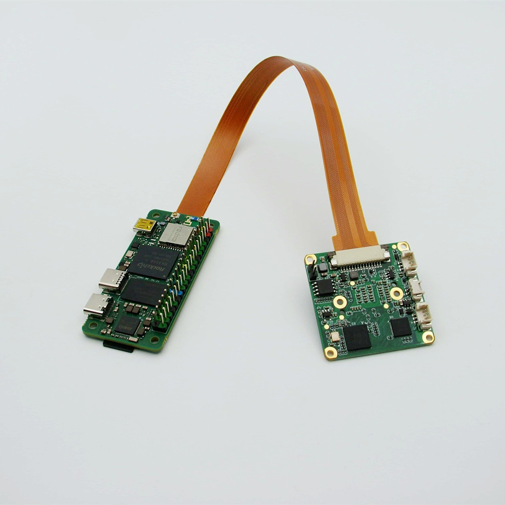

# How to use VEYE series cameras on Firefly's RK35XX board
This is a mirror of [our wiki article](https://wiki.veye.cc/index.php/VEYE_CS_Camera_on_Radxa_Boards).

[toc]

## Overview
VEYE series cameras are the video streaming mode MIPI cameras we designed. This article takes Radxa's ZERO 3W board as an example to introduce how to connect VEYE series cameras to RK3566/RK3568/RK3588 system.

We provide drivers for Linux.

## Camera Module List

| Series  | Model  | Status  |
| ------------ | ------------ | ------------ |
| VEYE Series  | VEYE-MIPI-IMX327S  | Done  |
| VEYE Series  | VEYE-MIPI-IMX462  | Done  |
| VEYE Series  | VEYE-MIPI-IMX385  | Done  |
In addition, the driver for the Fpdlink connection mode has been finished on the Linux system.

## Hardware Setup
Radxa ZERO 3W provides a 22-pin connector compatible with Raspberry Pi, allowing our camera to be installed on its motherboard without the need for an adapter board.

### Connection of Camera and Radxa ZERO 3W Board
Both use a 15-to-22-pin FFC cable for connection, ensuring that the silver contact surface faces outward.



## Introduction to github repositories
includes：
- driver source code
- i2c toolkits
- application demo

In addition, a compiled linux kernel installation package and Android image is provided in the releases.

## Upgrade Radxa Debain system
### Overview
This section describes how to update the RK35xx system to support our camera modules.
We provide a deb installation package that can be installed directly.

### Burn Radxa standard system
Refer to the [Radxa documentation](https://wiki.t-firefly.com/en/ROC-RK3566-PC/01-bootmode.html) to burn in a standard system.

### Using prebuilt Image and dtb file
Using the compiled debain installation package

On the RK35xx board,
Download the latest rk356x_Radxa_ubuntu.tar.gz from https://github.com/veyeimaging/rk35xx_Radxa/releases/ .


```shell
tar -xavf rk356x_radxa_zero3w.tar.gz

cd rk356x_radxa_zero3w/released_images/cam2m

sudo dpkg -i linux-headers-5.10.160-36-rk356x_5.10.160-36_arm64_cam2m.deb

sudo dpkg -i linux-image-5.10.160-36-rk356x_5.10.160-36_arm64_cam2m.deb

sudo reboot
```
If the version does not match, it needs to be compiled from the source code.

### Check system status
Run the following command to confirm whether the camera is probed.
- VEYE-MIPI-XXX
`dmesg | grep veye`
The output message appears as shown below：
```
veyecam2m 2-003b:  camera id is veyecam2m

veyecam2m 2-003b: sensor is IMX327
```
- Run the following command to check the presence of video node.

`ls /dev/video0`

The output message appears as shown below.

`video0`

For Radxa Zero 3W, the camera is connected to i2c-2.

## Samples
### v4l2-ctl

#### Install v4l2-utils

`sudo apt-get install v4l-utils`

####  List the data formats supported by the camera

`v4l2-ctl --list-formats-ext`

#### Snap YUV picture

`v4l2-ctl --set-fmt-video=width=1920,height=1080,pixelformat='NV12' --stream-mmap --stream-count=100 --stream-to=nv12-1920x1080.yuv`

For RK3566, also:
`v4l2-ctl --set-fmt-video=width=1920,height=1080,pixelformat=UYVY --stream-mmap --stream-count=1 --stream-to=uyvy-1920x1080.yuv`

You can use software like YUV Player or Vooya to play the images.

#### Check frame rate
`v4l2-ctl --set-fmt-video=width=1920,height=1080,pixelformat=NV12 --stream-mmap --stream-count=-1 --stream-to=/dev/null`

### yavta
```
git clone https://github.com/veyeimaging/yavta.git

cd yavta;make

./yavta -c1 -Fnv12-1920x1080.yuv --skip 0 -f NV12 -s 1920x1080 /dev/video0
```

### gstreamer
We provide several gstreamer routines that implement the preview, capture, and video recording functions. See the samples directory on github for details.

### Import to OpenCV

First install OpenCV:
`sudo apt install python3-opencv`

We provide several routines to import camera data into opencv. See the samples directory on github for details.


##  Compile drivers and dtb from source code
- RK356x

[https://github.com/veyeimaging/rk35xx_rodxa/tree/main/linux/drivers/rk356x](https://github.com/veyeimaging/rk35xx_rodxa/tree/main/linux/drivers/rk356x)


## i2c script for parameter configuration

Because of the high degree of freedom of our camera parameters, we do not use V4L2 parameters to control, but use scripts to configure parameters.

[https://github.com/veyeimaging/rk356x_rodxa/tree/main/i2c_cmd](https://github.com/veyeimaging/rk356x_rodxa/tree/main/i2c_cmd)

using -b option to identify which bus you want to use.

- VEYE series
Video Control Toolkits Manual ：[VEYE-MIPI-327 I2C](http://wiki.veye.cc/index.php/VEYE-MIPI-290/327_i2c/)

## References

- Radxa Zero 3W Manual
https://docs.radxa.com/zero/zero3

- BSP toolkit
https://radxa-repo.github.io/bsp/

## Document History
- 2024-04-24
Release 1st version.
